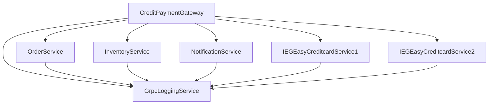

# SolTradingPlatform - Microservices Architecture

This project implements a distributed trading platform using microservices architecture with gRPC communication. The system uses the SAGA pattern for distributed transactions and includes multiple services for order processing, inventory management, payment processing, and notifications.

## Services Overview

### 1. CreditPaymentGateway (Port: 5241)
- **Role**: Main API gateway for processing credit card payments and orders
- **Features**:
  - Handles credit card payment requests
  - Implements SAGA pattern for distributed transactions
  - Load balances between two payment services
  - Coordinates with other services for order processing

### 2. OrderService (Port: 5000)
- **Role**: Manages order creation and processing
- **Features**:
  - Creates new orders
  - Updates order status
  - Cancels orders
  - Provides order information

### 3. InventoryService (Port: 5004)
- **Role**: Manages product inventory
- **Features**:
  - Checks stock availability
  - Reserves items for orders
  - Releases reserved items
  - Updates inventory levels

### 4. NotificationService (Port: 5005)
- **Role**: Handles system notifications
- **Features**:
  - Sends order completion notifications
  - Sends failure notifications
  - Manages notification preferences

### 5. GrpcLoggingService (Port: 5280)
- **Role**: Centralized logging service
- **Features**:
  - Collects logs from all services
  - Provides error tracking
  - Maintains system audit trail

### 6. Payment Services
#### IEGEasyCreditcardService1 (Port: 6001)
- **Role**: Primary payment processing service
- **Features**:
  - Processes credit card payments
  - Validates card details
  - Generates transaction IDs

#### IEGEasyCreditcardService2 (Port: 6002)
- **Role**: Secondary payment processing service (load balancing)
- **Features**:
  - Mirrors functionality of Service1
  - Provides redundancy
  - Enables load balancing

## Service Dependencies



## Starting the Services

Services must be started in the following order:

1. **GrpcLoggingService** (Port 5280)
```bash
dotnet run --project GrpcLoggingService/GrpcLoggingService.csproj
```

2. **Payment Services** (Ports 6001, 6002)
```bash
dotnet run --project IEGEasyCreditcardService1/IEGEasyCreditcardService1.csproj
dotnet run --project IEGEasyCreditcardService2/IEGEasyCreditcardService2.csproj
```

3. **Core Services** (Ports 5000, 5004, 5005)
```bash
dotnet run --project OrderService/OrderService.csproj
dotnet run --project InventoryService/InventoryService.csproj
dotnet run --project NotificationService/NotificationService.csproj
```

4. **CreditPaymentGateway** (Port 5241)
```bash
dotnet run --project CreditPaymentGateway/CreditPaymentGateway.csproj
```

## Testing the System

### 1. Test Payment Processing
```http
POST http://localhost:5241/CreditPayment/pay
Content-Type: application/json

{
    "cardNumber": "4111111111111111",
    "cardHolder": "John Doe",
    "expiration": "12/25"
}
```

### 2. Test Complete Order Processing
```http
POST http://localhost:5241/CreditPayment/process-order
Content-Type: application/json

{
    "customerId": "CUST123",
    "cardNumber": "4111111111111111",
    "cardHolder": "John Doe",
    "expiration": "12/25",
    "totalAmount": 150.00,
    "items": [
        {
            "productId": "PROD1",
            "quantity": 2,
            "price": 75.00
        }
    ]
}
```

## SAGA Pattern Implementation

The system implements the SAGA pattern for distributed transactions with the following steps:

1. **Create Order**
   - Creates order in OrderService
   - If fails, transaction is cancelled

2. **Reserve Inventory**
   - Checks and reserves items in InventoryService
   - If fails, compensates by cancelling order

3. **Process Payment**
   - Attempts payment through payment services
   - If fails, compensates by releasing inventory and cancelling order

4. **Send Notification**
   - Sends success notification
   - If fails, logs error but doesn't roll back (eventual consistency)

## Error Handling

- Each service implements its own error handling
- The SAGA pattern ensures transaction consistency
- Failed transactions trigger compensation actions
- All errors are logged to GrpcLoggingService

## Monitoring

- Each service exposes a health check endpoint at `/`
- GrpcLoggingService provides centralized logging
- Services log their operations and errors

## Development Notes

- All services use .NET 9.0
- gRPC is used for inter-service communication
- HTTP/2 is enabled for all services
- Services are configured for detailed error reporting
